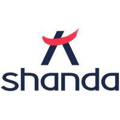
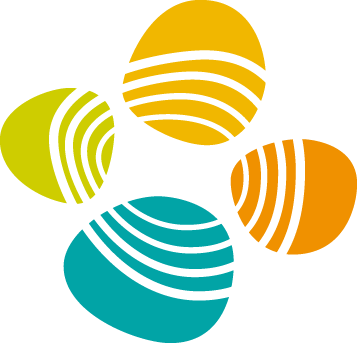

## 💼 Experience

<ul style="margin:0 0 5px;">
<li style="display: flex; justify-content: space-between; align-items: center; margin-left: -30px;">
  
    
     Research Intern at <strong>Shanda AI Research Centre</strong> & <strong>EverMind</strong>
  
  Sep 2025 - Jan 2026
</li>
<li style="display: flex; justify-content: space-between; align-items: center; margin-left: -30px; margin-bottom: 7px">
    
        
         Research Intern at Mohamed Elhoseiny's Group, <strong>KAUST</strong>
    
    Aug 2024 - May 2025
</li>
</ul>
